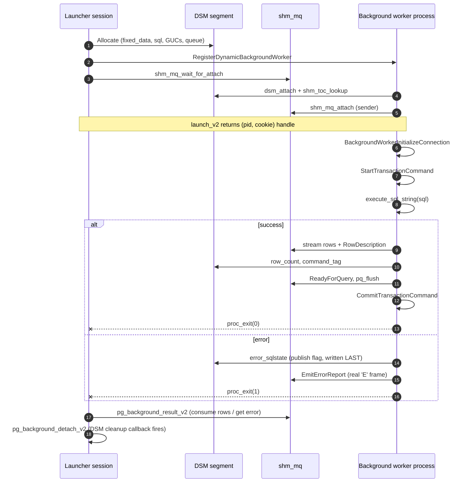

# pg_background: Production-Grade Background SQL for PostgreSQL

[](https://www.postgresql.org/)
[](https://github.com/vibhorkum/pg_background)
[](LICENSE)
[](https://github.com/vibhorkum/pg_background/actions/workflows/ci.yml)

Execute arbitrary SQL commands in **background worker processes** within PostgreSQL. Built for production workloads requiring asynchronous execution, autonomous transactions, and long-running operations without blocking client sessions.

### 30-second tour

```sql
CREATE EXTENSION pg_background;

-- Simplest case: run something in an autonomous transaction, get the outcome.
SELECT completed, has_error, sqlstate, error_message, row_count, command_tag, elapsed_ms
  FROM pg_background_run_v2(
         'INSERT INTO audit_log (ts, who) VALUES (now(), current_user)',
         queue_size := 0,
         timeout_ms := 30000,
         label      := 'audit-login'
       );

-- See every worker tracked by this session.
SELECT pid, state, label, sql_preview FROM pg_background_list;
```

When you need the actual result rows, swap `run_v2` for the
`launch_v2 → wait_v2 → result_v2` pattern shown in [Quick Start](#quick-start)
or [Cookbook recipe 2](#cookbook).

**Where to go next**

| If you want to… | Read |
|---|---|
| See it in 5 minutes | [Quick Start](#quick-start) |
| Copy a working pattern | [Cookbook](#cookbook) — three battle-tested templates |
| Look up a function | [API Reference](#complete-api-reference) |
| Understand the `cancel` vs `detach` distinction | [Critical Semantic Distinctions](#critical-semantic-distinctions) |
| Decide whether this fits your problem | [When to use this — and when not to](#when-to-use-this--and-when-not-to) |

---

## Table of Contents

- [Overview](#overview)
- [When to use this — and when not to](#when-to-use-this--and-when-not-to)
- [Key Features](#key-features)
- [PostgreSQL Version Compatibility](#postgresql-version-compatibility)
- [Installation](#installation)
- [Quick Start](#quick-start)
  - [V2 API (Recommended)](#v2-api-recommended)
  - [V1 API (Legacy)](#v1-api-legacy)
- [Complete API Reference](#complete-api-reference)
  - [V2 Functions](#v2-functions)
  - [V1 Functions (Deprecated)](#v1-functions-deprecated)
- [Critical Semantic Distinctions](#critical-semantic-distinctions)
  - [Cancel vs Detach](#cancel-vs-detach)
  - [V1 vs V2 API](#v1-vs-v2-api)
  - [PID Reuse Protection](#pid-reuse-protection)
  - [NOTIFY and Autonomous Commits](#notify-and-autonomous-commits)
- [Security Model](#security-model)
- [Operational Guidance](#operational-guidance)
  - [Resource Management](#resource-management)
  - [Performance Tuning](#performance-tuning)
  - [Monitoring](#monitoring)
- [Troubleshooting](#troubleshooting)
- [Architecture & Design](#architecture--design)
- [Known Limitations](#known-limitations)
- [Best Practices](#best-practices)
- [Cookbook](#cookbook)
- [Migration Guide](#migration-guide)
- [Testing](#testing)
- [Contributing](#contributing)
- [License](#license)
- [Author](#author)

---

## Overview

`pg_background` enables PostgreSQL to execute SQL commands asynchronously in dedicated background worker processes. Unlike `dblink` (which creates a separate connection) or client-side async patterns, `pg_background` workers run **inside** the database server with full access to local resources while operating in **independent transactions**.

**Production-Critical Benefits:**
- **Non-blocking operations**: Launch long-running queries without holding client connections
- **Autonomous transactions**: Commit/rollback independently of the caller's transaction
- **Resource isolation**: Workers have their own memory context and error handling
- **Observable lifecycle**: Track, cancel, and wait for completion with explicit operations
- **Security-hardened**: NOLOGIN role-based access, SECURITY DEFINER helpers, no PUBLIC grants

**Typical Production Use Cases:**
- Background maintenance (VACUUM, ANALYZE, REINDEX)
- Asynchronous audit logging
- Long-running ETL pipelines
- Independent notification delivery
- Parallel query pattern implementation

---

## When to use this — and when not to

### Good fit ✅
- **Autonomous transactions** — log audit events, send notifications, or update counters that must commit even if the parent transaction rolls back.
- **Ad-hoc async maintenance** — kick off a `VACUUM`, `REINDEX`, or backfill from a SQL session without blocking it.
- **Pre-known fan-out** — split a workload into N independent SQL statements and gather their outcomes (see [Cookbook recipe 3](#cookbook)).
- **Bounded long-running queries** with a deadline — `pg_background_run_v2(sql, queue_size, timeout_ms, label)` gives you a single SQL call with timeout and cancel-on-overrun.

### Not a fit ❌
| You want… | Use instead |
|---|---|
| A cron-style job scheduler | [`pg_cron`](https://github.com/citusdata/pg_cron) |
| Cross-server SQL execution | `dblink` or `postgres_fdw` |
| Cross-database execution | Workers are per-database; use `dblink` from inside a worker if you must |
| Workflow orchestration with retries / DAGs | An application-layer job runner |
| Persistent job queue with state across restarts | A real queue (Redis, RabbitMQ) or table-backed queue with explicit polling |
| Result caching / re-fetching | Workers stream results once; persist them to a table yourself |

`pg_background` provides primitives, not orchestration. If you need durable queueing, retries, scheduling, or coordination across sessions, build it on top — or use a tool that specializes in it.

### Side-by-side: `pg_background` vs neighboring tools

A 30-second decision table. Pick the row that matches your job, not the column you've used before.

| Capability | `pg_background` | `pg_cron` | `dblink` | `postgres_fdw` |
|---|---|---|---|---|
| Run SQL **in the background**, in the same db, in its own transaction | ✅ | ❌ runs on a schedule | ❌ runs in caller's flow | ❌ runs in caller's flow |
| **Autonomous transactions** (commit independently of caller) | ✅ | ✅ | ✅ (separate connection) | ❌ |
| **Scheduled / cron-style** execution | ❌ | ✅ | ❌ | ❌ |
| Run SQL on a **different host** | ❌ | ❌ | ✅ | ✅ |
| Run SQL in a **different database** of same cluster | ❌ | ✅ (per-db jobs) | ✅ | ✅ |
| **Cookie-protected** lifecycle (cancel/wait/list with PID-reuse safety) | ✅ | ❌ | ❌ | ❌ |
| **Structured error returns** (real SQLSTATE + detail/hint/context) | ✅ | partial | partial | partial |
| Expose **plan choice from the worker process** | ✅ via `pg_background_explain_v2` | ❌ | ❌ | ❌ |
| Persistent job state / **survives restart** | ❌ session-local | ✅ | ❌ | ❌ |
| **DAG / retry / dependency** orchestration | ❌ | ❌ | ❌ | ❌ |

**Common patterns**

- **Audit logging that must commit even on rollback** → `pg_background_run_v2` with `submit_v2`-style fire-and-forget. Don't use `dblink` (callable but heavier per call).
- **Nightly maintenance at 02:00** → `pg_cron`. Don't use `pg_background` (no scheduler).
- **Read from another host's table** → `postgres_fdw`. Don't use `pg_background` (single-host).
- **Synchronous fan-out: launch N updates, wait for all** → `pg_background_drain_v2`. Don't use `dblink` (no batch primitive).
- **Cancel a long-running job from another session** — none of these tools is great. `pg_background_cancel_v2` works but only from the launching session today; cluster-wide cancel needs a manual `pg_cancel_backend` against the worker PID.

---

## Architecture (one-page mental model)



**Key design points**

- The DSM segment is the only shared mutable state. The launcher's session-local hash table tracks the segment and the BGW handle but never holds a long-lived pointer into it.
- Errors propagate via two paths: the structured DSM fields (read by `error_info_v2`) and the live `'E'` frame on `shm_mq` (read by `result_v2`). Both must agree; the worker writes DSM first, then emits the frame.
- The launcher's `cleanup_worker_info` callback runs at DSM detach, so leaking a handle is impossible — even abnormal exit paths reclaim resources.

---

## Key Features

### Core capabilities
- **Async SQL execution** — offload queries to background workers running inside the server
- **Autonomous transactions** — workers commit (or roll back) independently of the caller
- **Explicit lifecycle** — `launch`, `wait`, `cancel`, `detach`, and `list` operations with documented semantics
- **Cookie-protected handles** — `(pid, cookie)` tuples prevent PID-reuse confusion in long-lived sessions
- **Structured error reporting** — real `SQLSTATE`, message, detail, hint, and context propagated from worker to launcher
- **Observability built in** — per-session worker registry (`pg_background_list`), counters (`pg_background_stats_v2`), progress reporting, optional labels
- **Hardened security** — NOLOGIN executor role, no PUBLIC grants, privilege helpers with pinned `search_path`
- **Relocatable** — `CREATE EXTENSION pg_background WITH SCHEMA myschema` works fully

### What's new in v1.10
- `pg_background_list` and `pg_background_activity` **views** — query the worker registry without repeating a 10-column definition list; the activity view joins `pg_stat_activity` for combined worker + backend visibility.
- `pg_background_outcome_v2(pid, cookie)` — combined `list_v2 + result_info_v2 + error_info_v2` snapshot that **never raises**; returns NULL fields when the handle is gone or results are already consumed.
- `pg_background_run_v2(sql, queue_size, timeout_ms, label)` — **synchronous one-shot**: launch + wait + outcome + detach in one call, with 1 s cancel-grace on timeout. Returns metadata only.
- **Convenience helpers** that replace common hand-rolled PL/pgSQL loops:
  - `pg_background_run_query_v2(...)` — synchronous one-shot that returns **result rows** (the `run_v2` companion).
  - `pg_background_drain_v2(handles[], timeout_ms)` — wait for many handles, collect one outcome each, detach.
  - `pg_background_wait_any_v2(handles[], timeout_ms)` — return the first handle to finish.
  - `pg_background_cancel_by_label_v2(pattern, grace_ms)` — cancel every worker whose label matches a `LIKE` pattern.
  - `pg_background_purge_v2()` — detach only workers that have already stopped.
  - `pg_background_status_v2(pid, cookie)` — `jsonb`-shaped outcome for driver-side consumption.
  - `pg_background_full_sql_v2(pid, cookie)` — the worker's full SQL (beyond the 120-char `list_v2` preview).

Older milestones (v1.6 cookies, v1.8 stats/GUCs/progress, v1.9 labels/structured errors/batch ops) are listed in the [Migration Guide](#migration-guide).

---

## PostgreSQL Version Compatibility

| PostgreSQL Version | Support Status | Notes |
|--------------------|----------------|-------|
| **18** | ✅ Fully Supported | TupleDescAttr compatibility layer |
| **17** | ✅ Fully Tested | Recommended for new deployments |
| **16** | ✅ Fully Tested | Production-ready |
| **15** | ✅ Fully Tested | pg_analyze_and_rewrite_fixedparams |
| **14** | ✅ Fully Tested | Minimum supported version |
| **13** | ❌ Not Supported | Use pg_background 1.6 or earlier |
| **< 13** | ❌ Not Supported | Use pg_background 1.4 or earlier |

**Note**: Each PostgreSQL major version requires extension rebuild against its headers.

---

## Installation

### Prerequisites

- PostgreSQL 14+ with development headers (`postgresql-server-dev-*` or `postgresql##-devel`)
- `pg_config` in `$PATH`
- Build essentials: `gcc`, `make`
- Superuser privileges for `CREATE EXTENSION`

### Build from Source

```bash
# Clone repository
git clone https://github.com/vibhorkum/pg_background.git
cd pg_background

# Build extension
make clean
make

# Install (requires appropriate privileges)
sudo make install
```

### Enable Extension

```sql
-- Connect as superuser
CREATE EXTENSION pg_background;

-- Verify installation
SELECT extname, extversion FROM pg_extension WHERE extname = 'pg_background';
-- Expected output:
--    extname     | extversion
-- ---------------+------------
--  pg_background | 1.9
```

### Library Loading

`pg_background` does **not** require `shared_preload_libraries`. Workers are
registered dynamically (`RegisterDynamicBackgroundWorker`) and each worker
process loads the library dynamically when it starts.

Adding `pg_background` to `shared_preload_libraries` is **optional** and only
needed if you want the extension's GUC parameters
(`pg_background.max_workers`, `pg_background.default_queue_size`,
`pg_background.worker_timeout`) available in `postgresql.conf` and visible in
all sessions from the start. Without SPL, the GUCs are registered on first
use (`CREATE EXTENSION`, `LOAD`, or the first `launch_v2` call). A session
`SET` before that point raises an `unrecognized configuration parameter`
error. The warning behavior applies to configuration file entries (for
example, `postgresql.conf` or `ALTER SYSTEM`) that are read before the
library is loaded.

| | Without SPL | With SPL |
|---|---|---|
| Extension works? | Yes | Yes |
| GUCs in `postgresql.conf` | Not until first load | Immediately |
| After `make install` | Workers pick up new `.so` automatically | **Restart required** (postmaster caches the library) |
| Recommended for | Development, staging, simple setups | Production with tuned GUCs |

### Custom Schema Installation

The extension is **relocatable**, allowing installation in any schema. This is useful for organizing extensions or avoiding namespace conflicts.

```sql
-- Create custom schema
CREATE SCHEMA contrib;

-- Install extension in custom schema
CREATE EXTENSION pg_background WITH SCHEMA contrib;

-- Verify installation
SELECT extname, extversion, nspname AS schema
FROM pg_extension e
JOIN pg_namespace n ON n.oid = e.extnamespace
WHERE e.extname = 'pg_background';
-- Expected output:
--    extname     | extversion | schema
-- ---------------+------------+---------
--  pg_background | 1.9        | contrib
```

**Using Extension in Custom Schema**:

When installed in a custom schema, functions can be called with schema qualification or by adding the schema to `search_path`:

```sql
-- Option 1: Schema-qualified calls
SELECT * FROM contrib.pg_background_launch_v2('SELECT 1') AS h;
SELECT * FROM contrib.pg_background_result_v2(h.pid, h.cookie) AS (result int);

-- Option 2: Add schema to search_path
SET search_path = contrib, public;
SELECT * FROM pg_background_launch_v2('SELECT 1') AS h;
```

**Privileges with Custom Schema**:

The privilege helper functions automatically detect the extension's schema:

```sql
-- Grant privileges (works regardless of installation schema)
SELECT contrib.grant_pg_background_privileges('app_user', true);

-- Or if schema is in search_path
SELECT grant_pg_background_privileges('app_user', true);
```

**Test Cases for Custom Schema Installation**:

```sql
-- Test 1: Basic installation in custom schema
CREATE SCHEMA test_schema;
CREATE EXTENSION pg_background WITH SCHEMA test_schema;

-- Test 2: Launch worker from custom schema
SELECT (h).pid, (h).cookie FROM test_schema.pg_background_launch_v2('SELECT 42') AS h \gset

-- Test 3: Retrieve results
SELECT * FROM test_schema.pg_background_result_v2(:pid, :cookie) AS (val int);
-- Expected: val = 42

-- Test 4: Privilege helpers work with custom schema
CREATE ROLE test_user NOLOGIN;
SELECT test_schema.grant_pg_background_privileges('test_user', true);
-- Should output GRANT statements with test_schema prefix

-- Test 5: Revoke privileges
SELECT test_schema.revoke_pg_background_privileges('test_user', true);

-- Test 6: V2 types are accessible
SELECT (ROW(123, 456789)::test_schema.pg_background_handle).*;
-- Expected: pid=123, cookie=456789

-- Cleanup
DROP ROLE test_user;
DROP EXTENSION pg_background;
DROP SCHEMA test_schema;
```

### Configure PostgreSQL

```sql
-- Set worker process limit (adjust based on your workload)
ALTER SYSTEM SET max_worker_processes = 32;

-- Reload configuration
SELECT pg_reload_conf();

-- Verify setting
SHOW max_worker_processes;
```

### Extension GUC Settings (v1.8+)

```sql
-- Limit concurrent workers per session (default: 16)
SET pg_background.max_workers = 10;

-- Set default queue size for workers (default: 64KB)
SET pg_background.default_queue_size = '256KB';

-- Set worker execution timeout (default: 0 = no limit)
SET pg_background.worker_timeout = '5min';
```

| GUC Parameter | Default | Range | Description |
|---------------|---------|-------|-------------|
| `pg_background.max_workers` | 16 | 1-1000 | Max concurrent workers per session |
| `pg_background.default_queue_size` | 65536 | 4KB-256MB | Default shared memory queue size |
| `pg_background.worker_timeout` | 0 | 0-∞ | Worker execution timeout (0 = no limit) |

---

## Quick Start

### V2 API (Recommended)

The v2 API provides cookie-based handle protection and explicit lifecycle semantics. If you only ever read one section, **use `pg_background_run_v2()`** (item 0 below) — it covers the common case in one SQL call.

#### 0. Easiest path: synchronous one-shot (`pg_background_run_v2`)

Use this when you want autonomous-transaction semantics and just need to know whether the SQL succeeded, how many rows it affected, and the SQLSTATE if it failed. Returns metadata only — no result rows.

```sql
SELECT completed, has_error, sqlstate, error_message,
       row_count, command_tag, elapsed_ms, timed_out
  FROM pg_background_run_v2(
         'INSERT INTO audit_log (ts, who) VALUES (now(), current_user)',
         queue_size := 0,
         timeout_ms := 30000,         -- 30 s cap; cancels with 1 s grace on overrun
         label      := 'audit-login'
       );

-- completed | has_error | sqlstate | error_message | row_count | command_tag | elapsed_ms | timed_out
-- t         | f         | NULL     | NULL          | 1         | INSERT 0 1  | 14         | f
```

When you actually need **result rows**, use the launch + wait + result_v2 pattern (items 1, 2, 5 below) or jump straight to [Cookbook recipe 2](#cookbook).

#### 1. Launch a Background Job

```sql
-- Launch worker and capture handle
SELECT * FROM pg_background_launch_v2(
  'SELECT pg_sleep(5); SELECT count(*) FROM large_table'
) AS handle;

-- Output:
--   pid  |      cookie       
-- -------+-------------------
--  12345 | 1234567890123456
```

#### 2. Retrieve Results

```sql
-- Results can only be consumed ONCE
SELECT * FROM pg_background_result_v2(12345, 1234567890123456) AS (count BIGINT);

-- Attempting second retrieval will error:
-- ERROR: results already consumed for worker PID 12345
```

#### 3. Fire-and-Forget (Submit)

```sql
-- For queries with side effects only (no result consumption needed)
SELECT * FROM pg_background_submit_v2(
  'INSERT INTO audit_log (ts, event) VALUES (now(), ''system_check'')'
) AS handle;

-- Worker commits and exits automatically
```

#### 4. Cancel a Running Job

```sql
-- Request immediate cancellation
SELECT pg_background_cancel_v2(pid, cookie);

-- Or with grace period (500ms to finish current statement)
SELECT pg_background_cancel_v2_grace(pid, cookie, 500);
```

⚠️ **Windows Limitation**: Cancel on Windows only sets interrupts; it cannot terminate an actively running statement. Always use `statement_timeout` on Windows.

#### 5. Wait for Completion

```sql
-- Block until worker finishes
SELECT pg_background_wait_v2(pid, cookie);

-- Or wait with timeout (returns true if completed)
SELECT pg_background_wait_v2_timeout(pid, cookie, 5000);  -- 5 seconds
```

#### 6. List Active Workers

```sql
SELECT *
FROM pg_background_list_v2()
AS (
  pid int4,
  cookie int8,
  launched_at timestamptz,
  user_id oid,
  queue_size int4,
  state text,
  sql_preview text,
  last_error text,
  consumed bool
)
ORDER BY launched_at DESC;
```

**State Values**:
- `running`: Actively executing SQL
- `stopped`: Completed successfully
- `canceled`: Terminated via `cancel_v2()`
- `error`: Failed with error (see `last_error`)

#### 7. View Session Statistics (v1.8+)

```sql
-- Get session-wide worker statistics
SELECT * FROM pg_background_stats_v2();

-- Output:
--  workers_launched | workers_completed | workers_failed | workers_active | avg_execution_ms | max_workers
-- ------------------+-------------------+----------------+----------------+------------------+-------------
--                42 |                38 |              2 |              2 |           1234.5 |          16
```

#### 8. Progress Reporting (v1.8+)

**From within worker SQL** (report progress):
```sql
-- Launch a worker that reports progress
SELECT * FROM pg_background_launch_v2($$
  SELECT pg_background_progress(0, 'Starting...');
  -- Do some work...
  SELECT pg_background_progress(25, 'Phase 1 complete');
  -- More work...
  SELECT pg_background_progress(50, 'Halfway done');
  -- Final work...
  SELECT pg_background_progress(100, 'Complete');
$$) AS h \gset;
```

**From launcher** (check progress):
```sql
-- Poll worker progress
SELECT * FROM pg_background_get_progress_v2(:'h.pid', :'h.cookie');

-- Output:
--  progress_pct | progress_msg
-- --------------+---------------
--            50 | Halfway done
```

### V1 API (Legacy)

The v1 API is retained for backward compatibility but **lacks cookie-based PID reuse protection**.

```sql
-- Launch (returns bare PID)
SELECT pg_background_launch('VACUUM VERBOSE my_table') AS pid \gset

-- Retrieve results
SELECT * FROM pg_background_result(:pid) AS (result TEXT);

-- Fire-and-forget (detach does NOT cancel!)
SELECT pg_background_detach(:pid);
```

⚠️ **Production Warning**: The v1 API is vulnerable to PID reuse over long session lifetimes. Always use v2 API in production.

---

## Complete API Reference

### V2 Functions

| Function | Returns | Description | Use Case |
|----------|---------|-------------|----------|
| `pg_background_launch_v2(sql, queue_size, label)` | `pg_background_handle` | Launch worker with optional label (v1.9) | Standard async execution |
| `pg_background_submit_v2(sql, queue_size, label)` | `pg_background_handle` | Fire-and-forget with optional label (v1.9) | Side-effect queries |
| `pg_background_result_v2(pid, cookie)` | `SETOF record` | Retrieve results (**one-time consumption**) | Collect query output |
| `pg_background_result_info_v2(pid, cookie)` | `pg_background_result_info` | Get result metadata (v1.9) | Check completion without consuming |
| `pg_background_error_info_v2(pid, cookie)` | `pg_background_error` | Get structured error details (v1.9) | Error diagnostics |
| `pg_background_detach_v2(pid, cookie)` | `void` | Stop tracking worker (worker continues) | Cleanup bookkeeping |
| `pg_background_detach_all_v2()` | `int4` | Detach all workers in session (v1.9) | Session cleanup |
| `pg_background_cancel_v2(pid, cookie)` | `void` | Request cancellation (best-effort) | Terminate unwanted work |
| `pg_background_cancel_v2_grace(pid, cookie, grace_ms)` | `void` | Cancel with grace period (max 3600000ms) | Allow statement to finish |
| `pg_background_cancel_all_v2()` | `int4` | Cancel all workers in session (v1.9) | Emergency cleanup |
| `pg_background_wait_v2(pid, cookie)` | `void` | Block until worker completes | Synchronous barrier |
| `pg_background_wait_v2_timeout(pid, cookie, timeout_ms)` | `bool` | Wait with timeout (returns `true` if done) | Bounded blocking |
| `pg_background_list_v2()` | `SETOF record` | List known workers in current session | Monitoring, debugging |
| `pg_background_stats_v2()` | `pg_background_stats` | Session statistics (v1.8+) | Monitoring, debugging |
| `pg_background_progress(pct, msg)` | `void` | Report progress from worker (v1.8+) | Long-running task feedback |
| `pg_background_get_progress_v2(pid, cookie)` | `pg_background_progress` | Get worker progress (v1.8+) | Monitor long-running tasks |
| `pg_background_outcome_v2(pid, cookie)` | `pg_background_outcome` | Combined status snapshot — never raises (v1.10) | Safe status retrieval |
| `pg_background_run_v2(sql, queue_size, timeout_ms, label)` | `pg_background_run_result` | Synchronous one-shot: launch + wait + outcome + detach (v1.10) | Autonomous-transaction-style runs |
| `pg_background_run_query_v2(sql, queue_size, timeout_ms, label, col_def)` | `SETOF record` | Synchronous one-shot that returns result rows; raises on worker error (v1.10) | Run-and-fetch in one call |
| `pg_background_drain_v2(handles[], timeout_ms)` | `SETOF pg_background_outcome` | Wait for every handle (shared wall-clock timeout), one outcome per handle, then detach (v1.10) | Gather many results |
| `pg_background_wait_any_v2(handles[], timeout_ms)` | `pg_background_handle` | Return the first handle to finish; NULL on timeout (v1.10) | Race several workers |
| `pg_background_cancel_by_label_v2(pattern, grace_ms)` | `int4` | Cancel every worker whose label matches a SQL `LIKE` pattern; returns count (v1.10) | Bulk cancel by label |
| `pg_background_purge_v2()` | `int4` | Detach only already-stopped workers; returns count purged (v1.10) | Selective cleanup |
| `pg_background_status_v2(pid, cookie)` | `jsonb` | `jsonb`-shaped `outcome_v2` snapshot (v1.10) | Driver-friendly status |
| `pg_background_full_sql_v2(pid, cookie)` | `text` | Full worker SQL, capped at 64 KiB (v1.10) | Debugging beyond `sql_preview` |
| `pg_background_list` (view, v1.10) | rows of `list_v2()` | Convenience view; no column-definition list required | Day-to-day observation |
| `pg_background_activity` (view, v1.10) | join with `pg_stat_activity` | Worker registry + backend state in one query | Combined monitoring |

**Parameters**:
- `sql`: SQL command(s) to execute (multiple statements allowed)
- `queue_size`: Shared memory queue size in bytes (default: 65536, min: 4096)
- `pid`: Process ID from handle
- `cookie`: Unique identifier from handle (prevents PID reuse)
- `label`: Optional worker label for identification (v1.9, default: NULL)
- `grace_ms`: Milliseconds to wait before forceful termination (capped at 1 hour)
- `timeout_ms`: Milliseconds to wait for completion
- `col_def`: Column-definition list for `run_query_v2`, matching the `AS` clause at the call site (e.g. `'x int, y text'`)
- `handles`: Array of `pg_background_handle` for `drain_v2` / `wait_any_v2`
- `pattern`: SQL `LIKE` pattern matched against worker labels in `cancel_by_label_v2`

**Handle Type**:
```sql
CREATE TYPE pg_background_handle AS (
  pid    int4,   -- Process ID
  cookie int8    -- Unique identifier (prevents PID reuse)
);
```

**Statistics Type** (v1.8+):
```sql
CREATE TYPE pg_background_stats AS (
  workers_launched   int8,    -- Total workers launched this session
  workers_completed  int8,    -- Workers completed successfully
  workers_failed     int8,    -- Workers that failed with error
  workers_active     int4,    -- Currently active workers
  avg_execution_ms   float8,  -- Average execution time
  max_workers        int4     -- Current max_workers setting
);
```

**Progress Type** (v1.8+):
```sql
CREATE TYPE pg_background_progress AS (
  progress_pct  int4,   -- Progress percentage (0-100)
  progress_msg  text    -- Brief status message
);
```

**Result Info Type** (v1.9+):
```sql
CREATE TYPE pg_background_result_info AS (
  row_count    int8,    -- Number of rows returned/affected
  command_tag  text,    -- Command tag (SELECT, INSERT, etc.)
  completed    bool,    -- True if worker completed
  has_error    bool     -- True if SQL execution error was captured
);
```

> **Note**: `has_error` indicates SQL execution errors captured through structured error reporting. Early worker failures (e.g., resource exhaustion, connection issues) before SQL execution begins do not set this flag. The combination of `completed=true`, `has_error=false`, and `error_info_v2() IS NULL` indicates likely success, but does not guarantee the worker completed without infrastructure-level failures.

**Error Type** (v1.9+):
```sql
CREATE TYPE pg_background_error AS (
  sqlstate  text,   -- SQLSTATE error code (e.g., '23505')
  message   text,   -- Primary error message
  detail    text,   -- Detailed error info (if any)
  hint      text,   -- Hint for resolution (if any)
  context   text    -- Error context/stack trace
);
```

**Outcome Type** (v1.10+):
```sql
CREATE TYPE pg_background_outcome AS (
  pid            int4,
  cookie         int8,
  state          text,         -- starting/running/stopped/canceled/error (NULL if not in this session)
  consumed       bool,
  completed      bool,         -- from result_info_v2
  has_error      bool,         -- from result_info_v2
  row_count      int8,         -- from result_info_v2
  command_tag    text,         -- from result_info_v2
  sqlstate       text,         -- from error_info_v2
  error_message  text,         -- from error_info_v2.message
  label          text,
  launched_at    timestamptz
);
```

`pg_background_outcome_v2()` populates this snapshot by combining
`pg_background_list_v2`, `pg_background_result_info_v2`, and
`pg_background_error_info_v2`. It catches all exceptions internally and leaves
unavailable fields NULL — handy after `result_v2` has consumed results, after a
worker has been cleaned up, or when you simply do not want to write three
nested `BEGIN ... EXCEPTION` blocks.

**Run Result Type** (v1.10+):
```sql
CREATE TYPE pg_background_run_result AS (
  pid             int4,
  completed       bool,
  timed_out       bool,
  has_error       bool,
  row_count       int8,
  command_tag     text,
  sqlstate        text,
  error_message   text,
  elapsed_ms      int8
);
```

`pg_background_run_v2(sql, queue_size, timeout_ms, label)` runs a single SQL
command in a worker, waits up to `timeout_ms` (0 = wait forever), cancels the
worker with 1 s grace if it does not finish in time, gathers the outcome, and
detaches the handle. It returns metadata only — no result rows. Use the
launch/wait/result_v2 pattern (see [Cookbook recipe 2](#cookbook)) when you
need result rows.

#### Structured Error Returns — SQLSTATE Semantics

`pg_background_error_info_v2(pid, cookie)` returns the **real** five-character
`SQLSTATE` emitted by the worker's failed statement, not a synthesized
`08006 "lost connection to worker process"`. The worker's `PG_CATCH` handler
copies `ErrorData` from the caught `ereport(ERROR)`, stores the fields in DSM
(with `error_sqlstate` written last as a publish flag) and calls
`EmitErrorReport()` + `ReadyForQuery(DestRemote)` + `pq_flush()` so the launcher
sees the actual `'E'` error frame over `shm_mq`.

Typical codes returned end-to-end (v1.9+):

| Trigger SQL                                      | Returned `sqlstate` | Path            |
|--------------------------------------------------|---------------------|-----------------|
| `SELECT 1/0`                                     | `22012`             | execute         |
| `RAISE EXCEPTION 'custom error'`                 | `P0001`             | execute         |
| `INSERT NULL` into `NOT NULL` column             | `23502`             | execute         |
| `INSERT` violating `INITIALLY DEFERRED` FK       | `23503`             | commit          |
| `pg_background_cancel_v2()` during `pg_sleep()`  | `57014`             | execute         |

**Recommended pattern**: call `error_info_v2` from the same PL/pgSQL
`EXCEPTION` block that observes the failure. Once the launcher's transaction
aborts, `cleanup_worker_info` removes the hash entry and the next transaction
will see `ERRCODE_UNDEFINED_OBJECT` ("PID N is not attached to this session").

```sql
DO $$
DECLARE
    h pg_background_handle;
    s text;
BEGIN
    h := pg_background_launch_v2('SELECT 1/0');
    PERFORM pg_background_wait_v2(h.pid, h.cookie);
    SELECT sqlstate INTO s
      FROM pg_background_error_info_v2(h.pid, h.cookie);
    RAISE NOTICE 'worker sqlstate=%', s;   -- 22012
    PERFORM pg_background_detach_v2(h.pid, h.cookie);
END$$;
```

> **Important — do not call `result_v2()` on an error path.** `result_v2()`
> re-raises the worker's error in the launcher via `ereport(ERROR)`, which
> aborts the current transaction and triggers `cleanup_worker_info` before you
> can inspect `error_info_v2()`. For error diagnosis, the supported pattern is
> `launch_v2 -> wait_v2 -> error_info_v2 -> detach_v2` (no `result_v2`).

> **`08006` is now reserved for infra-level failures only.** The launcher
> synthesizes `ERRCODE_CONNECTION_FAILURE "lost connection to worker process"`
> only when the worker died before it could propagate a real error (see
> [Known Limitations — Early worker failures](#9-early-worker-failures-before-pq_redirect_to_shm_mq)).
> Under normal operation, any SQL-level error inside the worker surfaces as
> the concrete SQLSTATE shown in the table above.

### Reloading the library after an upgrade

The compiled `pg_background.so` is reloaded differently depending on how it is
loaded (see [Library Loading](#library-loading)):

- **With `shared_preload_libraries`**: the postmaster dlopens the library once
  at startup and every worker inherits it. After replacing the `.so` you must
  **restart PostgreSQL** — `pg_reload_conf()` is not sufficient.
- **Without SPL** (the default): each worker dlopens the library in its own
  process, so the next `pg_background_launch_v2(...)` call picks up the new
  binary automatically. No restart needed; at most, reconnect long-lived
  client sessions.

### V1 Functions (Deprecated)

| Function | Returns | Description | Limitation |
|----------|---------|-------------|------------|
| `pg_background_launch(sql, queue_size)` | `int4` (PID) | Launch worker, return PID | Vulnerable to PID reuse |
| `pg_background_result(pid)` | `SETOF record` | Retrieve results | No cookie validation |
| `pg_background_detach(pid)` | `void` | Stop tracking worker | Does NOT cancel execution |

⚠️ **Migration Path**: Replace v1 calls with v2 equivalents in new code. See [Migration Guide](#migration-guide).

---

## Critical Semantic Distinctions

### Cancel vs Detach

**These operations are NOT interchangeable.** Confusion between them is a common source of production issues.

| Operation | Stops Execution | Prevents Commit | Removes Tracking |
|-----------|-----------------|-----------------|------------------|
| **`cancel_v2()`** | ⚠️ Best-effort (immediate on Unix, limited on Windows) | ⚠️ Best-effort | ❌ No |
| **`detach_v2()`** | ❌ No | ❌ No | ✅ Yes |

**Rule of Thumb**:
- Use **`cancel_v2()`** to **stop work** (terminate execution, prevent commit/notify)
- Use **`detach_v2()`** to **stop tracking** (free bookkeeping memory while worker continues)

#### Example: Detach Does NOT Prevent NOTIFY

```sql
-- Launch worker that sends notification
SELECT * FROM pg_background_launch_v2(
  $$SELECT pg_notify('alerts', 'system_event')$$
) AS h \gset

-- Detach only removes launcher's tracking
SELECT pg_background_detach_v2(:'h.pid', :'h.cookie');

-- Worker STILL runs and sends notification!
-- To actually prevent notification, use:
SELECT pg_background_cancel_v2(:'h.pid', :'h.cookie');
```

#### When to Use Each

**Use `cancel_v2()`**:
- User-initiated cancellation
- Timeout enforcement
- Rollback of unwanted side effects
- Immediate resource reclamation

**Use `detach_v2()`**:
- Long-running maintenance (don't need to track VACUUM for hours)
- Fire-and-forget after successful submission
- Session cleanup before disconnect
- Reducing launcher session memory usage

### V1 vs V2 API

| Aspect | V1 API | V2 API |
|--------|--------|--------|
| **Handle** | Bare `int4` PID | `(pid int4, cookie int8)` composite |
| **PID Reuse Protection** | ❌ None | ✅ Cookie validation |
| **Cancel Operation** | ❌ Not available | ✅ `cancel_v2()` / `cancel_v2_grace()` |
| **Wait Operation** | ❌ Not available (manual polling) | ✅ `wait_v2()` / `wait_v2_timeout()` |
| **Worker Listing** | ❌ Not available | ✅ `list_v2()` |
| **Submit (fire-forget)** | ⚠️ Use `detach()` after `launch()` | ✅ Dedicated `submit_v2()` |
| **Production Use** | ⚠️ Not recommended | ✅ Recommended |

#### Common V1 Pain Point: Column Definition Lists

A frequent source of confusion with the v1 API is the requirement to specify column definitions when retrieving results:

```sql
-- V1 API: MUST specify column definition list
SELECT * FROM pg_background_result(
  pg_background_launch('SELECT pg_sleep(3); SELECT ''done''')
) AS (result text);

-- Without it, you get:
-- ERROR: a column definition list is required for functions returning "record"

-- And if your query returns multiple columns, you must match them exactly:
SELECT * FROM pg_background_result(
  pg_background_launch('SELECT ''done'', ''here''')
) AS (col1 text, col2 text);
-- Mismatched columns cause: ERROR: remote query result rowtype does not match
```

**V2 Solution**: If you just need to wait for completion without retrieving results, use `wait_v2()`:

```sql
-- V2 API: Wait for completion without dealing with result columns
SELECT (h).pid, (h).cookie
FROM pg_background_launch_v2('SELECT pg_sleep(3); SELECT ''done'', ''here''') AS h \gset

-- Simply wait - no column definition needed!
SELECT pg_background_wait_v2(:pid, :cookie);

-- Or with timeout (returns true if completed, false if timed out)
SELECT pg_background_wait_v2_timeout(:pid, :cookie, 5000);

-- Cleanup
SELECT pg_background_detach_v2(:pid, :cookie);
```

This is especially useful for:
- Background maintenance tasks (VACUUM, ANALYZE)
- Fire-and-forget operations where you only care about completion
- Cases where the result structure may vary

### PID Reuse Protection

**The Problem**: Operating systems recycle process IDs. On busy systems, a PID can be reused within minutes.

**V1 API Risk** (PID-only reference):
```sql
-- Day 1: Launch worker
SELECT pg_background_launch('slow_query()') AS pid \gset

-- Day 2: Session still alive, but worker PID may be reused
-- This could attach to a DIFFERENT worker with the SAME PID!
SELECT pg_background_result(:pid);  -- ⚠️ DANGEROUS
```

**V2 API Fix** (PID + Cookie):
```sql
-- Launch with cookie
SELECT * FROM pg_background_launch_v2('slow_query()') AS h \gset

-- Days later: cookie validation prevents mismatch
SELECT pg_background_result_v2(:'h.pid', :'h.cookie');
-- If PID reused, cookie won't match → safe error
```

**Implementation**: Each worker generates a random 64-bit cookie at launch. All operations validate `(pid, cookie)` tuple matches.

### NOTIFY and Autonomous Commits

Workers execute in **separate transactions** from the launcher. This has critical implications:

#### Autonomous Transaction Behavior

```sql
BEGIN;
  -- Launcher transaction starts

  SELECT * FROM pg_background_launch_v2(
    'INSERT INTO audit_log VALUES (now(), ''user_action'')'
  ) AS h \gset;
  
  -- Main work
  UPDATE users SET status = 'active' WHERE id = 123;
  
  -- If we ROLLBACK, the audit_log INSERT still commits!
ROLLBACK;

-- audit_log entry exists despite rollback
```

**Implications**:
- ✅ **Good for**: Audit logging, NOTIFY, stats collection
- ⚠️ **Bad for**: Interdependent data modifications requiring ACID

#### NOTIFY Delivery with Detach

```sql
-- Worker sends notification
SELECT * FROM pg_background_launch_v2(
  $$SELECT pg_notify('channel', 'message')$$
) AS h \gset;

-- Detach removes tracking but does NOT cancel
SELECT pg_background_detach_v2(:'h.pid', :'h.cookie');

-- Notification WILL be delivered (worker commits independently)
```

To **prevent** notification delivery:
```sql
-- Cancel before worker commits
SELECT pg_background_cancel_v2(:'h.pid', :'h.cookie');
```

---

## Security Model

### Privilege Architecture

`pg_background` uses a role-based security model with zero PUBLIC access by default.

#### Default Setup (Automatic)

```sql
-- Extension creates this role automatically:
CREATE ROLE pgbackground_role NOLOGIN INHERIT;

-- All pg_background user-facing functions granted to this role.
-- SECURITY DEFINER privilege helpers (grant/revoke/drop_executor_role)
-- are admin-only and NOT granted to pgbackground_role.
-- PUBLIC has NO access by default
```

#### Grant Access to Users

```sql
-- Method 1: Direct role grant (recommended)
GRANT pgbackground_role TO app_user;

-- Method 2: Helper function (explicit EXECUTE grants)
SELECT grant_pg_background_privileges('app_user', true);
```

#### Revoke Access

```sql
-- Method 1: Revoke role membership
REVOKE pgbackground_role FROM app_user;

-- Method 2: Helper function
SELECT revoke_pg_background_privileges('app_user', true);
```

### Security Considerations

#### 1. SQL Injection Prevention

❌ **Unsafe** (vulnerable to SQL injection):
```sql
CREATE FUNCTION unsafe_launch(user_input text) RETURNS void AS $$
BEGIN
  -- NEVER concatenate untrusted input!
  PERFORM pg_background_launch_v2(
    'SELECT * FROM users WHERE name = ''' || user_input || ''''
  );
END;
$$ LANGUAGE plpgsql;
```

✅ **Safe** (parameterized with `format()`):
```sql
CREATE FUNCTION safe_launch(user_input text) RETURNS void AS $$
BEGIN
  -- Use %L for literal quoting
  PERFORM pg_background_launch_v2(
    format('SELECT * FROM users WHERE name = %L', user_input)
  );
END;
$$ LANGUAGE plpgsql;
```

#### 2. Resource Exhaustion Protection

```sql
-- Application-level quota enforcement
CREATE OR REPLACE FUNCTION launch_with_limit(sql text)
RETURNS pg_background_handle AS $$
DECLARE
  active_count int;
  h pg_background_handle;
BEGIN
  -- Count active workers for current user
  SELECT count(*) INTO active_count
  FROM pg_background_list_v2() AS (
    pid int4, cookie int8, launched_at timestamptz, user_id oid,
    queue_size int4, state text, sql_preview text, last_error text, consumed bool
  )
  WHERE user_id = current_user::regrole::oid
    AND state IN ('running');
  
  IF active_count >= 5 THEN
    RAISE EXCEPTION 'User worker limit exceeded (max 5 concurrent)';
  END IF;
  
  SELECT * INTO h FROM pg_background_launch_v2(sql);
  RETURN h;
END;
$$ LANGUAGE plpgsql SECURITY DEFINER;
```

#### 3. Privilege Isolation

- ✅ Workers inherit **current_user** from launcher (not superuser escalation)
- ✅ `SECURITY DEFINER` helpers use pinned `search_path = pg_catalog`
- ✅ No ambient PUBLIC grants
- ⚠️ Workers can access all databases launcher can access

#### 4. Information Disclosure Risks

```sql
-- list_v2() exposes SQL previews (first 120 chars) and error messages
-- For sensitive deployments, create restricted view:

CREATE VIEW safe_worker_list AS
SELECT pid, cookie, state, consumed, launched_at
FROM pg_background_list_v2() AS (
  pid int4, cookie int8, launched_at timestamptz, user_id oid,
  queue_size int4, state text, sql_preview text, last_error text, consumed bool
)
WHERE user_id = current_user::regrole::oid;
-- Omit sql_preview and last_error

GRANT SELECT ON safe_worker_list TO app_users;
```

### Security Best Practices

1. **Never grant `pgbackground_role` to PUBLIC**
2. **Use v2 API exclusively** (cookie protection)
3. **Set `statement_timeout`** to bound execution time
4. **Implement application-level quotas** (max workers per user/database)
5. **Sanitize all dynamic SQL** with `format()` or `quote_literal()`
6. **Monitor `list_v2()`** for suspicious activity
7. **Audit `pg_stat_activity`** for background worker usage
8. **Test disaster recovery** with active workers

---

## Operational Guidance

### Resource Management

#### max_worker_processes Limit

Background workers count against PostgreSQL's global `max_worker_processes` limit.

**Check Current Usage**:
```sql
SELECT count(*) AS bgworker_count
FROM pg_stat_activity
WHERE backend_type LIKE '%background%';
```

**Recommended Configuration**:
```sql
-- Formula: autovacuum_workers + max_parallel_workers + pg_background_estimate + buffer
ALTER SYSTEM SET max_worker_processes = 64;  -- Adjust per workload
SELECT pg_reload_conf();
```

**Operational Limits**:
- Default `max_worker_processes`: 8 (often insufficient)
- Recommended minimum for pg_background: 16-32
- Enterprise workloads: 64-128
- Each worker: ~10MB memory overhead

#### Dynamic Shared Memory (DSM) Usage

Each worker allocates one DSM segment for IPC.

**Monitor DSM**:
```sql
SELECT
  name,
  size,
  allocated_size
FROM pg_shmem_allocations
WHERE name LIKE '%pg_background%'
ORDER BY size DESC;
```

**DSM Size**:
- Default queue_size: 65536 bytes (~64KB)
- Minimum queue_size: 4096 bytes (enforced by `shm_mq`)
- Large result sets: increase queue_size parameter

**Example**:
```sql
-- Small results (default)
SELECT pg_background_launch_v2('SELECT id FROM small_table', 65536);

-- Large results (1MB queue)
SELECT pg_background_launch_v2('SELECT * FROM huge_table', 1048576);
```

#### Worker Lifecycle and Cleanup

**Automatic Cleanup**:
- Worker exits → DSM detached → hash entry removed
- Launcher session ends → all tracked workers detached

**Manual Cleanup**:
```sql
-- Detach all completed workers
DO $$
DECLARE r record;
BEGIN
  FOR r IN
    SELECT *
    FROM pg_background_list_v2() AS (
      pid int4, cookie int8, launched_at timestamptz, user_id oid,
      queue_size int4, state text, sql_preview text, last_error text, consumed bool
    )
    WHERE state IN ('stopped', 'canceled', 'error')
  LOOP
    PERFORM pg_background_detach_v2(r.pid, r.cookie);
  END LOOP;
END;
$$;
```

### Performance Tuning

#### 1. Queue Size Optimization

**Rule of Thumb**:
- Small queries (< 1000 rows): 65536 (64KB, default)
- Medium queries (< 10000 rows): 262144 (256KB)
- Large queries (>= 10000 rows): 1048576+ (1MB+)

**Trade-offs**:
- Larger queue → less blocking on result production
- Larger queue → more shared memory consumption
- Too small → worker blocks waiting for launcher to consume

**Measure Contention**:
```sql
-- Check if worker is blocking on queue send
SELECT
  pid,
  state,
  wait_event_type,
  wait_event
FROM pg_stat_activity
WHERE backend_type LIKE '%background%'
  AND wait_event = 'SHM_MQ_SEND';
```

#### 2. Statement Timeout

Workers inherit `statement_timeout` from launcher session.

**Set Per-Worker Timeout**:
```sql
-- Temporarily increase timeout
SET statement_timeout = '30min';
SELECT pg_background_launch_v2('slow_aggregation_query()');
RESET statement_timeout;
```

**Set Database-Wide Default**:
```sql
ALTER DATABASE production SET statement_timeout = '10min';
```

#### 3. Work Memory

**Important**: Workers do NOT inherit `work_mem` from launcher.

**Workaround**:
```sql
-- Include SET in worker SQL
SELECT pg_background_launch_v2($$
  SET work_mem = '256MB';
  SELECT * FROM large_table ORDER BY col;
$$);
```

#### 4. Parallel Workers

Background workers are separate from `max_parallel_workers`.

**Configuration**:
```sql
-- Both settings are independent
ALTER SYSTEM SET max_worker_processes = 64;     -- Total pool
ALTER SYSTEM SET max_parallel_workers = 16;     -- Parallel query subset
```

### Monitoring

#### Real-Time Worker Status

```sql
CREATE VIEW pg_background_status AS
SELECT
  w.pid,
  w.cookie,
  w.state,
  left(w.sql_preview, 60) AS sql_snippet,
  w.launched_at,
  (now() - w.launched_at) AS age,
  w.consumed,
  a.state AS pg_state,
  a.wait_event_type,
  a.wait_event,
  a.query AS current_query
FROM pg_background_list_v2() AS (
  pid int4, cookie int8, launched_at timestamptz, user_id oid,
  queue_size int4, state text, sql_preview text, last_error text, consumed bool
) w
LEFT JOIN pg_stat_activity a USING (pid)
ORDER BY w.launched_at DESC;

-- Query it
SELECT * FROM pg_background_status;
```

#### Alerting on Long-Running Workers

```sql
-- Workers running > 1 hour
SELECT
  pid,
  cookie,
  sql_preview,
  (now() - launched_at) AS duration
FROM pg_background_list_v2() AS (
  pid int4, cookie int8, launched_at timestamptz, user_id oid,
  queue_size int4, state text, sql_preview text, last_error text, consumed bool
)
WHERE state = 'running'
  AND (now() - launched_at) > interval '1 hour';
```

#### Prometheus-Style Metrics

```sql
-- Export metrics for monitoring systems
SELECT
  'pg_background_active_workers' AS metric,
  count(*) AS value,
  state AS labels
FROM pg_background_list_v2() AS (
  pid int4, cookie int8, launched_at timestamptz, user_id oid,
  queue_size int4, state text, sql_preview text, last_error text, consumed bool
)
GROUP BY state;
```

---

## Troubleshooting

### Common Issues

#### Issue 1: "could not register background process"

**Symptom**:
```
ERROR: could not register background process
HINT: You may need to increase max_worker_processes.
```

**Cause**: `max_worker_processes` limit reached.

**Solution**:
```sql
-- Check current limit and usage
SHOW max_worker_processes;
SELECT count(*) FROM pg_stat_activity WHERE backend_type LIKE '%worker%';

-- Increase limit (requires restart for some versions)
ALTER SYSTEM SET max_worker_processes = 32;
SELECT pg_reload_conf();  -- Or restart PostgreSQL
```

#### Issue 2: "cookie mismatch for PID XXXXX"

**Symptom**:
```
ERROR: cookie mismatch for PID 12345: expected 1234567890123456, got 9876543210987654
```

**Cause**: PID reused after worker exit, or stale handle.

**Solution**:
- Always use fresh handles from `launch_v2()`
- Never hardcode PID/cookie values
- Don't cache handles across long time periods

```sql
-- ❌ Bad: Reusing old handle
-- h was from hours ago, worker exited, PID reused

-- ✅ Good: Fresh handle per operation
SELECT * FROM pg_background_launch_v2('...') AS h \gset
SELECT pg_background_wait_v2(:'h.pid', :'h.cookie');
```

#### Issue 3: Worker Hangs Indefinitely

**Symptom**: Worker shows `running` state for hours without progress.

**Cause**: Lock contention, infinite loop, or missing `CHECK_FOR_INTERRUPTS`.

**Diagnosis**:
```sql
-- Check what worker is waiting on
SELECT
  w.pid,
  w.sql_preview,
  a.wait_event_type,
  a.wait_event,
  a.state,
  a.query
FROM pg_background_list_v2() AS (
  pid int4, cookie int8, launched_at timestamptz, user_id oid,
  queue_size int4, state text, sql_preview text, last_error text, consumed bool
) w
JOIN pg_stat_activity a USING (pid)
WHERE w.state = 'running';

-- Check locks
SELECT
  l.pid,
  l.locktype,
  l.relation::regclass,
  l.mode,
  l.granted
FROM pg_locks l
WHERE l.pid = <worker_pid>;
```

**Solution**:
```sql
-- Cancel with grace period
SELECT pg_background_cancel_v2_grace(<pid>, <cookie>, 5000);

-- Force cancel if grace period expires
SELECT pg_background_cancel_v2(<pid>, <cookie>);
```

#### Issue 4: "results already consumed"

**Symptom**:
```
ERROR: results already consumed for worker PID 12345
```

**Cause**: Attempting to call `result_v2()` twice on same handle.

**Solution**: Results are **one-time consumption**. Use CTE to reuse:
```sql
-- ✅ Correct: Use CTE to consume once
WITH worker_results AS (
  SELECT * FROM pg_background_result_v2(<pid>, <cookie>) AS (col text)
)
SELECT * FROM worker_results
UNION ALL
SELECT * FROM worker_results;
```

#### Issue 5: DSM Allocation Failure

**Symptom**:
```
ERROR: could not allocate dynamic shared memory
```

**Cause**: Insufficient shared memory or too many DSM segments.

**Solution**:
```sql
-- Check DSM usage
SELECT count(*), sum(size) AS total_bytes
FROM pg_shmem_allocations
WHERE name LIKE '%dsm%';

-- Increase shared memory (postgresql.conf)
-- dynamic_shared_memory_type = posix  (or sysv, mmap)
-- Restart PostgreSQL
```

#### Issue 6: Custom Schema Installation Errors (Fixed in v1.7+)

**Symptom** (in versions before fix):
```
CREATE EXTENSION pg_background WITH SCHEMA contrib;
ERROR: function public.grant_pg_background_privileges(unknown, boolean) does not exist
```

**Cause**: Hardcoded `public.` schema references in SQL scripts when extension is relocatable.

**Status**: **Fixed in v1.7+** for fresh installations. The extension now properly supports custom schema installation.

**Solution for fresh install**:
```sql
-- Install directly in custom schema (v1.7+)
CREATE SCHEMA myschema;
CREATE EXTENSION pg_background WITH SCHEMA myschema;

-- Verify
SELECT * FROM myschema.pg_background_launch_v2('SELECT 1') AS h;
```

**⚠️ Limitation for upgrades**: If you have v1.4, v1.5, or v1.6 already installed, upgrading to v1.7/v1.8 will NOT move the extension to a custom schema. The upgrade scripts for older versions contain hardcoded `public.` references because those versions only supported the public schema.

**To relocate an existing installation**:
```sql
-- 1. Drop existing extension
DROP EXTENSION pg_background;

-- 2. Reinstall in desired schema
CREATE EXTENSION pg_background WITH SCHEMA myschema;
```

#### Issue 7: Column Definition List Required (V1 API)

**Symptom**:
```
SELECT pg_background_result(pg_background_launch('SELECT ''done'''));
ERROR: function returning record called in context that cannot accept type record
HINT: Try calling the function in the FROM clause using a column definition list.

-- Or when columns don't match:
SELECT * FROM pg_background_result(...) AS (result text);
ERROR: remote query result rowtype does not match the specified FROM clause rowtype
```

**Cause**: The v1 `pg_background_result()` returns `SETOF record`, which requires PostgreSQL to know the column types at parse time.

**Solution 1** - Match column definitions exactly:
```sql
-- Single column result
SELECT * FROM pg_background_result(
  pg_background_launch('SELECT ''done''')
) AS (result text);

-- Multiple columns - must match exactly
SELECT * FROM pg_background_result(
  pg_background_launch('SELECT ''done'', ''here''')
) AS (col1 text, col2 text);
```

**Solution 2** - Use V2 API `wait_v2()` if you don't need results:
```sql
-- Launch the worker
SELECT (h).pid, (h).cookie
FROM pg_background_launch_v2('SELECT pg_sleep(3); SELECT ''done'', ''here''') AS h \gset

-- Wait for completion - no column definition needed!
SELECT pg_background_wait_v2(:pid, :cookie);

-- Cleanup
SELECT pg_background_detach_v2(:pid, :cookie);
```

**Recommendation**: Migrate to the V2 API which provides `wait_v2()` for cases where you only need to wait for completion without retrieving results.

### Platform-Specific Issues

#### Windows: Cancel Limitations

**Problem**: On Windows, `cancel_v2()` cannot interrupt actively running statements.

**Explanation**: Windows lacks signal-based interrupts. Cancel only sets interrupt flags checked between statements.

**Workaround**:
```sql
-- Always set statement_timeout on Windows
ALTER DATABASE mydb SET statement_timeout = '5min';

-- Or per-worker:
SELECT pg_background_launch_v2($$
  SET statement_timeout = '5min';
  SELECT slow_function();
$$);
```

**Affected Operations**:
- Long-running CPU-bound queries
- Infinite loops in PL/pgSQL
- Queries with no yielding points

**See**: `windows/README.md` for details.

### Debug Logging

```sql
-- Enable verbose logging
SET client_min_messages = DEBUG1;
SET log_min_messages = DEBUG1;

-- Launch worker (check logs for DSM info)
SELECT * FROM pg_background_launch_v2('SELECT 1') AS h \gset;

-- Check PostgreSQL logs for:
-- - "registered dynamic background worker"
-- - "DSM segment attached"
-- - Worker execution details
```

---

## Architecture & Design

### High-Level Architecture

```
┌──────────────────┐
│  Client Session  │
│  (Launcher)      │
└────────┬─────────┘
         │ 1. pg_background_launch_v2(sql)
         ▼
┌──────────────────────────────────┐
│  Extension C Code                │
│  - Allocate DSM segment          │
│  - RegisterDynamicBgWorker()     │
│  - Create shm_mq                 │
│  - Wait for worker attach        │
└────────┬─────────────────────────┘
         │ 2. Postmaster fork()
         ▼
┌──────────────────────────────────┐
│  Background Worker Process       │
│  - Attach database               │
│  - Restore session GUCs          │
│  - Execute SQL via SPI           │
│  - Send results via shm_mq       │
│  - Exit (DSM cleanup)            │
└──────────────────────────────────┘
         │ 3. Results via shared memory
         ▼
┌──────────────────┐
│  Launcher        │
│  pg_background_  │
│  result_v2()     │
└──────────────────┘
```

### Key Components

#### 1. Dynamic Shared Memory (DSM)

**Purpose**: IPC mechanism for SQL text and result transport.

**Structure**:
- **Key 0 (Fixed Data)**: Session metadata (user, database, cookie)
- **Key 1 (SQL)**: SQL command string (null-terminated)
- **Key 2 (GUC)**: Session GUC settings (serialized)
- **Key 3 (Queue)**: Bidirectional message queue (shm_mq)

**Lifecycle**:
- Created by launcher in `launch_v2()`
- Attached by worker on startup
- Detached by worker on exit (automatic cleanup)
- Launcher detaches on `detach_v2()` or session end

#### 2. Shared Memory Queue (shm_mq)

**Purpose**: Bidirectional streaming transport for results.

**Flow**:
1. Worker executes query via SPI
2. Each result row serialized to shm_mq
3. Launcher reads from shm_mq in `result_v2()`
4. Queue blocks if full (backpressure)

**Tuning**:
- Queue size set at launch (default 64KB)
- Larger queues reduce blocking
- Monitor with `pg_stat_activity.wait_event = 'SHM_MQ_SEND'`

#### 3. Background Worker API

**Registration**:
```c
BackgroundWorker worker;
worker.bgw_flags = BGWORKER_SHMEM_ACCESS | BGWORKER_BACKEND_DATABASE_CONNECTION;
worker.bgw_start_time = BgWorkerStart_ConsistentState;
worker.bgw_main = pg_background_worker_main;
RegisterDynamicBackgroundWorker(&worker, &handle);
```

**Lifecycle Hooks**:
- `bgw_main`: Entry point (`pg_background_worker_main`)
- `bgw_notify_pid`: Launcher PID (for notifications)
- `bgw_main_arg`: DSM handle (Datum)

#### 4. Server Programming Interface (SPI)

**Execution Pipeline**:
```c
SPI_connect();
SPI_execute(sql, false, 0);  // read_only=false, limit=0
while (SPI_processed > 0) {
    // Send result rows via shm_mq
}
SPI_finish();
```

**Result Serialization**:
- `RowDescription`: Column metadata (names, types, formats)
- `DataRow`: Binary-encoded tuple data
- `CommandComplete`: Result tag (e.g., "SELECT 42")

#### 5. Worker Hash Table

**Purpose**: Per-session tracking of launched workers.

**Structure**:
```c
typedef struct pg_background_worker_info {
    int pid;
    uint64 cookie;
    dsm_segment *seg;
    BackgroundWorkerHandle *handle;
    shm_mq_handle *responseq;
    bool consumed;  // Result retrieval guard
} pg_background_worker_info;
```

**Cleanup**:
- On worker exit: `cleanup_worker_info()` callback
- On launcher session end: detach all tracked workers
- On explicit `detach_v2()`: remove hash entry

### Concurrency and Race Conditions

#### NOTIFY Race (Solved in v1.5+)

**Problem**: Launcher returned before worker attached shm_mq → lost NOTIFYs.

**Solution**: `shm_mq_wait_for_attach()` blocks launcher until worker ready.

```c
// In pg_background_launch_v2:
shm_mq_wait_for_attach(mqh);  // BLOCK until worker attaches
return handle;  // Safe to return now
```

#### PID Reuse (Solved in v2 API)

**Problem**: Worker exits, PID reused, launcher attaches to wrong worker.

**Solution**: 64-bit random cookie validated on all operations.

```c
// Generate cookie at launch
fixed_data->cookie = (uint64)random() << 32 | random();

// Validate on every operation
if (worker_info->cookie != provided_cookie)
    ereport(ERROR, "cookie mismatch");
```

#### DSM Cleanup Races (Hardened in v1.6)

**Problem**: Launcher `pfree(handle)` before worker attached → crash.

**Solution**: Never explicitly free handle; let PostgreSQL manage lifetime.

```c
// ❌ OLD (buggy): pfree(handle);
// ✅ NEW: Let handle live until dsm_detach
```

---

## Known Limitations

### 1. Windows Cancel Limitations

**Limitation**: `cancel_v2()` on Windows cannot interrupt running statements.

**Details**:
- Windows lacks `SIGUSR1` equivalent for query cancellation
- Cancel only sets `InterruptPending` flag
- Flag checked between statements, not during execution

**Impact**:
- Infinite loops in PL/pgSQL cannot be interrupted
- Long-running aggregate functions cannot be interrupted mid-execution
- `pg_sleep()` DOES check interrupts (interruptible)

**Workarounds**:
1. Always set `statement_timeout`:
   ```sql
   ALTER DATABASE mydb SET statement_timeout = '5min';
   ```
2. Avoid infinite loops in worker SQL
3. Test cancellation on Unix/Linux platforms first

**Reference**: See `windows/README.md` for implementation details.

### 2. No Cross-Database Workers

**Limitation**: Workers can only connect to the **same database** as launcher.

**Reason**: `BackgroundWorker` API requires database OID at registration.

**Workaround**: Use `dblink` for cross-database operations:
```sql
SELECT pg_background_launch_v2($$
  SELECT * FROM dblink('dbname=other_db', 'SELECT ...')
$$);
```

### 3. Per-Session Worker Limits (v1.8+)

**v1.8 Improvement**: Built-in `pg_background.max_workers` GUC limits concurrent workers per session.

```sql
-- Limit to 10 concurrent workers per session
SET pg_background.max_workers = 10;
```

**Remaining Limitation**: No per-user or per-database quotas across sessions.

**Workaround**: Implement application-level quotas for cross-session limits (see [Security](#security-model)).

### 4. Worker Exhaustion (INSUFFICIENT_RESOURCES)

**Limitation**: When `max_worker_processes` is exhausted, `pg_background_launch()` and `pg_background_launch_v2()` throw `INSUFFICIENT_RESOURCES`.

**Error Message**:
```
ERROR: could not register background process
HINT: You may need to increase max_worker_processes.
```

**Impact**: This is particularly problematic for **autonomous logging** use cases:
1. **Data Loss**: The message intended for logging is lost
2. **Cascading Failures**: The calling transaction may fail unexpectedly
3. **Unpredictable**: Failures occur sporadically under high load

**Why This Happens**: Background workers share the global `max_worker_processes` pool with:
- Parallel query workers (`max_parallel_workers`)
- Autovacuum workers (`autovacuum_max_workers`)
- Logical replication workers
- Custom background workers from other extensions

**Mitigation Strategies**:

1. **Increase worker pool** (reduces frequency, doesn't eliminate):
   ```sql
   ALTER SYSTEM SET max_worker_processes = 64;
   -- Requires PostgreSQL restart
   ```

2. **Implement retry with backoff**:
   ```sql
   BEGIN
     SELECT pg_background_launch_v2(...);
   EXCEPTION
     WHEN insufficient_resources THEN
       PERFORM pg_sleep(0.1);  -- Backoff
       -- Retry or fallback
   END;
   ```

3. **Fallback to synchronous execution** (for critical operations):
   ```sql
   EXCEPTION
     WHEN insufficient_resources THEN
       -- Execute synchronously as fallback
       INSERT INTO audit_log VALUES (...);
   END;
   ```

4. **Pre-check worker availability** (advisory, not guaranteed):
   ```sql
   SELECT count(*) < current_setting('max_worker_processes')::int
   FROM pg_stat_activity
   WHERE backend_type LIKE '%worker%';
   ```

5. **Reserve capacity** by setting conservative `pg_background.max_workers`:
   ```sql
   -- Leave headroom for other workers
   SET pg_background.max_workers = 8;  -- Even if pool is 64
   ```

**Recommendation**: For mission-critical logging, always implement a synchronous fallback. Autonomous transactions via pg_background are **best-effort**, not guaranteed.

**See Also**: [Autonomous Audit Logging](#2-autonomous-audit-logging) for robust implementation patterns.

### 5. Result Consumption is One-Time

**Limitation**: `result_v2()` can only be called **once** per handle.

**Reason**: Results streamed from DSM; no persistent storage.

**Workaround**: Use CTE or temporary table:
```sql
-- Store results in temp table
CREATE TEMP TABLE worker_output AS
  SELECT * FROM pg_background_result_v2(<pid>, <cookie>) AS (col text);

-- Query multiple times
SELECT * FROM worker_output WHERE col LIKE '%foo%';
SELECT count(*) FROM worker_output;
```

### 6. No Result Pagination

**Limitation**: Cannot retrieve results in chunks (all-or-nothing).

**Reason**: shm_mq is streaming; no cursor support.

**Impact**: Large result sets (> queue_size) may block worker.

**Workaround**:
- Increase `queue_size` parameter
- Use `LIMIT` in worker SQL
- Process results incrementally in launcher

### 7. Limited Observability

**Limitation**: `list_v2()` only shows workers in **current session**.

**Reason**: Hash table is session-local (not shared memory).

**Impact**: Cannot observe other sessions' workers.

**Workaround**: Query `pg_stat_activity`:
```sql
SELECT
  pid,
  backend_type,
  state,
  query,
  backend_start
FROM pg_stat_activity
WHERE backend_type LIKE '%background%';
```

### 8. No Transaction Pinning

**Limitation**: Worker transactions are **fully autonomous** (cannot join launcher's transaction).

**Reason**: PostgreSQL does not support distributed transactions.

**Impact**: Cannot implement 2PC-like patterns natively.

**Workaround**: Use `dblink` with `PREPARE TRANSACTION` for XA-like semantics.

### 9. Early Worker Failures (Before `pq_redirect_to_shm_mq`)

**Limitation**: Errors raised in the worker **before** `pq_redirect_to_shm_mq()`
installs the shm_mq destination cannot be captured as a structured error.

**What is "early"**: The small window between worker startup and the
`pq_redirect_to_shm_mq()` call in `pg_background_worker_main` — primarily:

- Failure to attach the DSM segment (`dsm_attach` returning NULL).
- `shm_toc_lookup` failure (missing TOC entry — implies an internally
  inconsistent DSM, typically a sign of server misconfiguration).
- Out-of-memory during the initial worker setup allocations.

**Observable behavior for the launcher**:

- `pg_background_result_v2()` raises `SQLSTATE 08006 "lost connection to
  worker process"` when it tries to read results from the detached shm_mq.
  `pg_background_wait_v2()` blocks on `WaitForBackgroundWorkerShutdown` and
  returns silently — it does not raise; the early worker exit leaves no
  structured error on the wire for it to observe.
- `pg_background_error_info_v2()` returns `NULL` row (no structured info).
- `pg_background_result_info_v2()` reports `completed=true, has_error=false`
  since the worker never got far enough to run SQL.

**Why it cannot be captured**: the worker's error-propagation contract
(`EmitErrorReport` over shm_mq, `ReadyForQuery(DestRemote)`, `pq_flush`)
requires the shm_mq destination to already be installed. Before
`pq_redirect_to_shm_mq`, `ereport(ERROR)` goes to the server log only; the
launcher observes the worker exit and synthesizes `08006`.

**Impact in practice**: these are infrastructure-level failures (DSM OOM,
misconfigured `dynamic_shared_memory_type`, missing `shm_toc` entry). They
are rare in a correctly configured server and do not indicate user-level SQL
problems.

**Recommended handling**: treat a `08006` from `pg_background_result_v2()`
as an infra signal — do not attempt to parse an `error_info_v2` row that may
be `NULL`. All ordinary SQL errors (syntax, constraint violation,
division-by-zero, `RAISE EXCEPTION`, statement cancel) propagate through the
normal path and appear as their real SQLSTATE, not `08006`.

---

## Best Practices

A quick checklist; the linked sections cover each in depth.

1. **Use the v2 API in production.** The `(pid, cookie)` handle protects against PID reuse; the v1 trio does not (see [V1 vs V2 API](#v1-vs-v2-api)).
2. **Bound every worker with a timeout** — a database/role `statement_timeout`, an inline `SET statement_timeout` in the SQL, or `run_v2`'s `timeout_ms` (see [Recipe 1](#cookbook)).
3. **Use `submit_v2()` for fire-and-forget** rather than `launch_v2 + detach_v2`.
4. **Clean up finished workers** with `pg_background_purge_v2()` (detaches only stopped/errored/canceled handles) instead of hand-rolled `list_v2` cleanup loops (see [Monitoring](#monitoring)).
5. **Sanitize all dynamic SQL** with `format()` — `%I` for identifiers, `%L` for literals (see [Security Best Practices](#security-best-practices)).
6. **On the error path, read `error_info_v2()` — never `result_v2()`.** `result_v2()` re-raises and aborts the transaction before you can inspect the error (see [Recipe 2](#cookbook) and the footgun note in the [API reference](#structured-error-returns--sqlstate-semantics)).
7. **Label workers** (`label` parameter) and/or lead the SQL with a comment so `list_v2.sql_preview` is self-documenting.
8. **Test disaster recovery**: a server restart loses all workers, and stale handles must fail gracefully — `wait_v2()` on a handle from a crashed worker raises rather than hanging.

---

## Cookbook

Copy-paste templates for the most common patterns. Each is built on v1.10 helpers and avoids the `result_v2`-on-error footgun.

### Recipe 1: Synchronous run with metadata (v1.10)

When you want autonomous-transaction semantics and just need to know whether it worked, how many rows were affected, and the SQLSTATE on failure. Returns metadata only — for result rows use Recipe 2.

```sql
-- One call: launch, wait, capture metadata, detach.
SELECT pid, completed, timed_out, has_error, row_count, command_tag,
       sqlstate, error_message, elapsed_ms
  FROM pg_background_run_v2(
         'INSERT INTO audit_log SELECT now(), current_user, ''login''',
         queue_size  := 0,
         timeout_ms  := 30000,    -- 30s cap; cancels with 1s grace on overrun
         label       := 'audit-login'
       );
```

### Recipe 2: Wait-with-timeout, then capture result rows or error (no footgun)

When you need the actual result rows. Uses `outcome_v2` to inspect state without raising; only calls `result_v2` on the success path.

```sql
DO $$
DECLARE
    h pg_background_handle;
    o pg_background_outcome;
    finished bool;
BEGIN
    h := pg_background_launch_v2('SELECT id, name FROM big_table WHERE active', 65536, 'lookup');

    finished := pg_background_wait_v2_timeout(h.pid, h.cookie, 5000);
    IF NOT finished THEN
        PERFORM pg_background_cancel_v2_grace(h.pid, h.cookie, 1000);
        PERFORM pg_background_detach_v2(h.pid, h.cookie);
        RAISE EXCEPTION 'lookup did not complete within 5s';
    END IF;

    o := pg_background_outcome_v2(h.pid, h.cookie);
    IF o.has_error THEN
        PERFORM pg_background_detach_v2(h.pid, h.cookie);
        RAISE EXCEPTION 'lookup failed: % (sqlstate %)', o.error_message, o.sqlstate;
    END IF;

    -- Safe: only consume result rows on the success path.
    INSERT INTO lookup_cache (id, name)
    SELECT id, name
      FROM pg_background_result_v2(h.pid, h.cookie) AS r(id int, name text);

    PERFORM pg_background_detach_v2(h.pid, h.cookie);
END
$$;
```

### Recipe 3: Launch many, gather outcomes

When you fan out N independent jobs and want a per-worker outcome row.

```sql
WITH launched AS (
    -- Launch N jobs; each row stores (pid, cookie) for later collection.
    SELECT (pg_background_launch_v2(
              format('VACUUM (ANALYZE) %I', tablename),
              0,
              'nightly-vacuum-' || tablename)).*
      FROM pg_tables WHERE schemaname = 'public'
),
waited AS (
    -- Block on each in parallel-ish (sequential here; parallelism is via async workers).
    SELECT l.pid,
           l.cookie,
           pg_background_wait_v2_timeout(l.pid, l.cookie, 60000) AS finished
      FROM launched l
)
SELECT w.pid,
       w.finished,
       o.completed,
       o.has_error,
       o.row_count,
       o.command_tag,
       o.sqlstate,
       o.error_message,
       o.label
  FROM waited w,
       LATERAL pg_background_outcome_v2(w.pid, w.cookie) AS o;

-- Detach everything still tracked in this session.
SELECT pg_background_detach_all_v2();
```

### Recipe 4: Autonomous audit logging that survives worker exhaustion

Workers commit independently of the caller, which makes them ideal for audit
rows that must persist even when the calling transaction rolls back. But if
`max_worker_processes` is exhausted, `submit_v2()` raises
`INSUFFICIENT_RESOURCES` (see [Known Limitation #4](#4-worker-exhaustion-insufficient_resources))
— so a robust logger retries with backoff and falls back to a synchronous
insert rather than losing the record.

```sql
CREATE FUNCTION log_audit(event_type text, details jsonb)
RETURNS void AS $$
DECLARE
  h          pg_background_handle;
  backoff_ms int := 100;
BEGIN
  FOR i IN 1..3 LOOP
    BEGIN
      SELECT * INTO h FROM pg_background_submit_v2(
        format('INSERT INTO audit_log (ts, event_type, details) '
               'VALUES (now(), %L, %L)', event_type, details::text),
        0, 'audit');
      PERFORM pg_background_detach_v2(h.pid, h.cookie);
      RETURN;
    EXCEPTION WHEN insufficient_resources THEN
      IF i = 3 THEN
        -- Last resort: log synchronously (blocks, but never loses data).
        INSERT INTO audit_log (ts, event_type, details)
        VALUES (now(), event_type, details);
        RAISE WARNING 'pg_background exhausted; audit logged synchronously';
        RETURN;
      END IF;
      PERFORM pg_sleep(backoff_ms / 1000.0);
      backoff_ms := backoff_ms * 2;
    END;
  END LOOP;
END;
$$ LANGUAGE plpgsql;
```

---

## Migration Guide

### Upgrading from v1.9 to v1.10

```sql
ALTER EXTENSION pg_background UPDATE TO '1.10';
```

**What you get**:
- `pg_background_list` view (no column-definition list at the call site).
- `pg_background_activity` view (joined with `pg_stat_activity`).
- `pg_background_outcome_v2()` — never-raises status snapshot.
- `pg_background_run_v2()` — synchronous one-shot.

**Action items**:
1. No code change required. Existing v1 and v2 callers keep working.
2. Optional: replace ad-hoc column-def lists with the new `pg_background_list` view in monitoring queries.
3. Optional: replace bespoke `launch + wait + cleanup` wrappers with `pg_background_run_v2()`.

### Upgrading from v1.8 to v1.9

```sql
ALTER EXTENSION pg_background UPDATE TO '1.9';
```

**What you get**:
- `label` parameter on `launch_v2`/`submit_v2` for operational clarity.
- `pg_background_error_info_v2()` returning structured errors with real `SQLSTATE`.
- `pg_background_result_info_v2()` for row count / command tag / completion flags.
- Batch helpers: `pg_background_detach_all_v2()`, `pg_background_cancel_all_v2()`.

**Upgrading from a pre-1.8 release?** The chained upgrade scripts live in
[`extension/legacy/`](extension/legacy/); step up to 1.8 with repeated
`ALTER EXTENSION pg_background UPDATE TO '<next>'`, then follow the 1.8→1.9→1.10
path above. Notable milestones along the way: **v1.6** revoked PUBLIC access
(grant `pgbackground_role` to users afterward), **v1.7** added custom-schema
support, **v1.8** added stats/GUCs/progress.

> **Moving an existing install into a custom schema** is only possible on a
> fresh `CREATE EXTENSION` (upgrade scripts keep objects where they are). To
> relocate, drop and reinstall — your data tables are unaffected:
> ```sql
> DROP EXTENSION pg_background;
> CREATE EXTENSION pg_background WITH SCHEMA myschema;
> ```

### Migrating from v1 to v2 API

The v1 API is frozen and will receive only critical security fixes. New code should use v2 because it provides cookie-based PID-reuse protection, explicit cancel/wait semantics, structured error returns, and observability via `pg_background_list` / `pg_background_stats_v2`.

#### Side-by-side mapping

| v1 (Legacy) | v2 (Recommended) | Notes |
|---|---|---|
| `pg_background_launch(sql, queue_size)` → `int4` | `pg_background_launch_v2(sql, queue_size, label)` → `pg_background_handle` | v2 returns `(pid, cookie)` composite; cookie protects against PID reuse |
| `pg_background_result(pid)` → `SETOF record` | `pg_background_result_v2(pid, cookie)` → `SETOF record` | Same one-time consumption rule. Avoid calling on errored workers — use `error_info_v2` instead |
| `pg_background_detach(pid)` → `void` | `pg_background_detach_v2(pid, cookie)` → `void` | Detach removes tracking; the worker keeps running and commits |
| _(no equivalent)_ | `pg_background_submit_v2(sql, queue_size, label)` → `pg_background_handle` | Dedicated fire-and-forget; clearer than `launch + detach` |
| _(no equivalent)_ | `pg_background_cancel_v2(pid, cookie)` / `..._grace(pid, cookie, ms)` | Cooperative cancel via SIGTERM; grace variant escalates to SIGKILL after `ms` |
| _(no equivalent)_ | `pg_background_wait_v2(pid, cookie)` / `..._timeout(pid, cookie, ms)` | Block until the worker exits, optionally with a deadline |
| _(no equivalent)_ | `pg_background_list_v2()` / `pg_background_list` view | Per-session worker registry with state, label, last_error |
| _(no equivalent)_ | `pg_background_stats_v2()` | Counters: launched, completed, failed, canceled, active, avg_execution_ms |
| _(no equivalent)_ | `pg_background_result_info_v2(pid, cookie)` | Row count, command tag, completion/error flags — without consuming results |
| _(no equivalent)_ | `pg_background_error_info_v2(pid, cookie)` | Structured error: SQLSTATE, message, detail, hint, context |
| _(no equivalent)_ | `pg_background_outcome_v2(pid, cookie)` (v1.10) | Combined snapshot of state + result_info + error_info — never raises |
| _(no equivalent)_ | `pg_background_run_v2(sql, queue_size, timeout_ms, label)` (v1.10) | Synchronous one-shot: launch + wait + outcome + detach |

#### Example migration

Before (v1):
```sql
-- fire-and-forget VACUUM
SELECT pg_background_launch('VACUUM my_table') AS pid \gset
SELECT pg_background_detach(:pid);
```

After (v2, idiomatic):
```sql
-- explicit fire-and-forget
SELECT * FROM pg_background_submit_v2('VACUUM my_table', 0, 'nightly-vacuum') AS h \gset
SELECT pg_background_detach_v2(:'h.pid', :'h.cookie');
```

After (v2, simpler — v1.10 one-shot):
```sql
-- synchronous: returns when done with metadata, no result rows
SELECT * FROM pg_background_run_v2('VACUUM my_table', 0, 0, 'nightly-vacuum');
```

---

## Testing

### Local Testing (Native)

If you have PostgreSQL development files installed locally:

```bash
# Build and install
make clean && make
sudo make install

# Run regression tests
make installcheck

# Clean test artifacts
make installcheckclean
```

### Docker-Based Testing (Recommended)

Docker-based testing requires no local PostgreSQL installation:

```bash
# Test with PostgreSQL 17 (default)
./scripts/test-local.sh

# Test with specific PostgreSQL version
./scripts/test-local.sh 14
./scripts/test-local.sh 16

# Test all supported versions (14-18)
./scripts/test-local.sh all
```

### Relocatable Extension Testing

Verify the extension works correctly when installed in a custom schema:

```bash
# Run comprehensive relocatable tests
./scripts/test-relocatable.sh 17
```

### Upgrade Path Testing

Validate extension upgrades work correctly:

```bash
# Test 1.8 → 1.9 upgrade path
./scripts/test-upgrade.sh 17
```

### CI Pipeline

The project uses GitHub Actions for continuous integration:

| Job | Description |
|-----|-------------|
| **test** | Matrix: PG 14-18 × ubuntu-22.04/24.04 regression tests |
| **relocatable-test** | Validates custom schema installation (PG 17) |
| **upgrade-test** | Validates 1.8 → 1.9 upgrade path |
| **lint** | cppcheck and clang-format checks |
| **security** | CodeQL security analysis |

All tests must pass before merging to main branches.

---

## Contributing

We welcome contributions! Please see [docs/CONTRIBUTING.md](docs/CONTRIBUTING.md) for:
- Code of conduct
- Development setup
- Coding standards (PostgreSQL style, `pgindent`)
- Testing requirements
- Pull request process

**Quick Start**:
```bash
git clone https://github.com/vibhorkum/pg_background.git
cd pg_background
make clean && make && sudo make install
make installcheck
```

**Before Submitting PR**:
- [ ] Code follows PostgreSQL conventions
- [ ] Regression tests added/updated
- [ ] Tests pass (`make installcheck`)
- [ ] No compiler warnings
- [ ] Documentation updated

---

## License

This project is licensed under the [PostgreSQL License](LICENSE).

Copyright (c) 2014-2026, Vibhor Kumar and contributors.
Portions Copyright (c) 1996-2026, PostgreSQL Global Development Group.

---

## Author

**Vibhor Kumar** – Original author and maintainer

**Inspiration**:
- PostgreSQL Background Worker API
- `dblink` extension
- Oracle DBMS_JOB

---

## Related Projects

- **[pg_cron](https://github.com/citusdata/pg_cron)** – Schedule periodic jobs  
- **[dblink](https://www.postgresql.org/docs/current/dblink.html)** – Cross-database/async queries  
- **[pgAgent](https://www.pgagent.org/)** – Job scheduler daemon  
- **[pg_task](https://github.com/RekGRpth/pg_task)** – Task queue extension  

---

**Production Deployments**: For critical workloads, always:
1. Use **v2 API exclusively** (cookie-protected handles)
2. Set **statement_timeout** on all workers
3. **Monitor** `pg_background_list_v2()` and `pg_stat_activity`
4. **Test** disaster recovery scenarios (restarts, crashes)
5. **Audit** privilege grants regularly

**Version**: 1.8
**Last Updated**: 2026-02-18
**Minimum PostgreSQL**: 14
**Tested Through**: PostgreSQL 18
