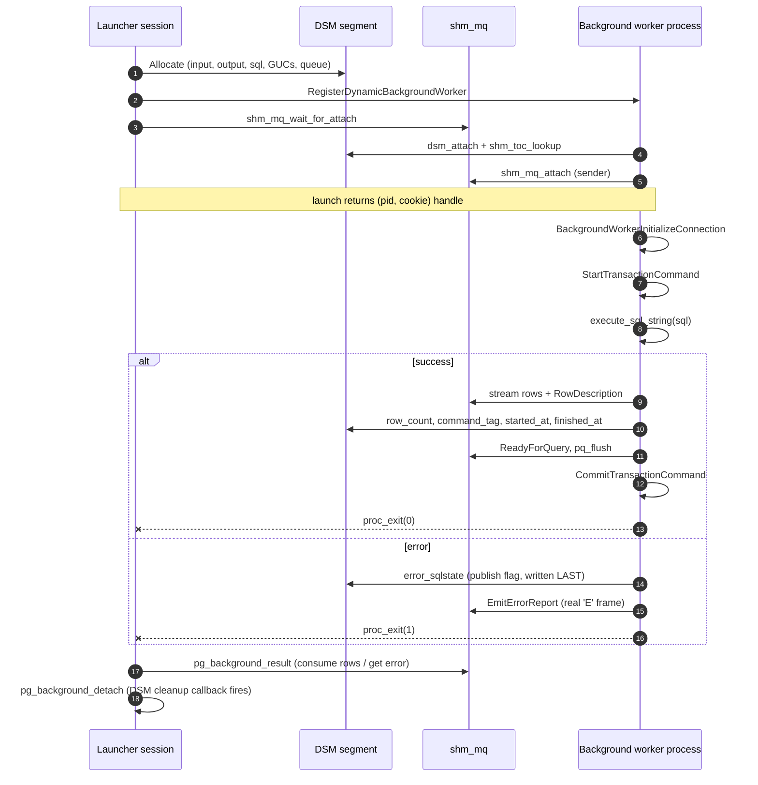

# pg_background — Architecture & Design

This document describes how `pg_background` is built. For end-user API
docs see [`README.md`](../README.md); for migration between versions see
[`docs/MIGRATION.md`](MIGRATION.md).

---

## One-page mental model



**Key design points**

- The DSM segment is the only shared mutable state. The launcher's
  session-local hash table tracks the segment and the BGW handle but
  never holds a long-lived pointer into it.
- Errors propagate via two paths: the structured DSM fields (read by
  `error_info`) and the live `'E'` frame on `shm_mq` (read by
  `result`). Both must agree; the worker writes DSM first, then emits
  the frame.
- The launcher's `cleanup_worker_info` callback runs at DSM detach, so
  leaking a handle is impossible — even abnormal exit paths reclaim
  resources.

---

## High-level data flow

```
┌──────────────────┐
│  Client Session  │
│  (Launcher)      │
└────────┬─────────┘
         │ 1. pg_background_launch(sql)
         ▼
┌──────────────────────────────────┐
│  Extension C Code                │
│  - Allocate DSM segment          │
│  - RegisterDynamicBgWorker()     │
│  - Create shm_mq                 │
│  - Wait for worker attach        │
└────────┬─────────────────────────┘
         │ 2. Postmaster fork()
         ▼
┌──────────────────────────────────┐
│  Background Worker Process       │
│  - Attach database               │
│  - Restore session GUCs          │
│  - Execute SQL via SPI           │
│  - Send results via shm_mq       │
│  - Exit (DSM cleanup)            │
└──────────────────────────────────┘
         │ 3. Results via shared memory
         ▼
┌──────────────────┐
│  Launcher        │
│  pg_background_  │
│  result()     │
└──────────────────┘
```

---

## Key components

### Dynamic Shared Memory (DSM)

**Purpose**: IPC mechanism for SQL text, GUC state, and result transport.

**TOC layout (v2.0)**:

| Key | Name | Direction | Contents |
|---|---|---|---|
| 0 | `INPUT` | launcher → worker | database/user OIDs, security context, cookie, label, `cancel_requested` (mutable) |
| 1 | `SQL` | launcher → worker | SQL command string (null-terminated) |
| 2 | `GUC` | launcher → worker | serialized session GUCs |
| 3 | `QUEUE` | bidirectional | `shm_mq` for result streaming |
| 4 | `OUTPUT` | worker → launcher | progress, error fields, result row count, command tag, started_at, finished_at, error-source identifiers |

**v2.0 (C1)** split the previous single `FIXED_DATA` chunk into INPUT and
OUTPUT under separate TOC keys. The split clarifies barrier ordering and
avoids cache-line bouncing between launcher and worker.

**Lifecycle**:
- Created by the launcher in `launch_internal()` (allocates both INPUT
  and OUTPUT, zero-fills OUTPUT, populates INPUT).
- Worker attaches at startup and looks up both keys.
- Launcher detaches via `detach()` or session end. The worker's own
  `dsm_detach` on exit drops its reference; the segment is released when
  refcount hits zero.

### Shared memory queue (shm_mq)

**Purpose**: bidirectional streaming transport for results, ReadyForQuery
frames, and any NOTIFY/'A' frames the worker emits.

**Flow**:
1. Worker executes the query via SPI.
2. Each result row is serialized to the shm_mq.
3. The launcher reads from the queue in `pg_background_result`.
4. Queue blocks the writer if full (backpressure).

**Receive-side liveness check (v2.0 C3)**: the launcher's read loop uses
non-blocking `shm_mq_receive` + `WaitLatch(... PG_WAIT_EXTENSION)` with a
periodic `GetBackgroundWorkerPid` check. A worker that attaches but never
sends and never exits no longer hangs the launcher session indefinitely;
the launcher detects the BGW stopping and treats the queue as detached.

**Tuning**:
- Queue size set at launch (default 64 KiB; bounded above at 256 MiB).
- Larger queues reduce launcher-side blocking on bursty result streams.
- Monitor with `pg_stat_activity.wait_event = 'SHM_MQ_SEND'` /
  `'MessageQueueReceive'`.

### Background worker API

**Registration**:
```c
BackgroundWorker worker;
worker.bgw_flags = BGWORKER_SHMEM_ACCESS | BGWORKER_BACKEND_DATABASE_CONNECTION;
worker.bgw_start_time = BgWorkerStart_ConsistentState;
worker.bgw_main = pg_background_worker_main;
RegisterDynamicBackgroundWorker(&worker, &handle);
```

**Lifecycle hooks**:
- `bgw_main`: entry point (`pg_background_worker_main` in
  `src/pg_background_worker.c`).
- `bgw_notify_pid`: launcher PID (for postmaster-driven notifications).
- `bgw_main_arg`: DSM handle (Datum).

### Server Programming Interface (SPI)

**Execution pipeline**: parse → analyze → plan → execute via Portal.
The worker calls into `pg_parse_query`, `pg_analyze_and_rewrite_*`,
`pg_plan_queries`, `CreatePortal`, `PortalStart`, `PortalRun`. Results
flow through a remote `DestReceiver` that writes into `shm_mq`.

**Result serialization on the wire**:
- `RowDescription`: column metadata (names, types, formats).
- `DataRow`: binary-encoded tuple data.
- `CommandComplete`: result tag (e.g., "SELECT 42"); the worker also
  writes the row count and command tag into the OUTPUT struct so
  `result_info` can report them without re-reading the queue.

### Worker hash table

**Purpose**: per-session tracking of launched workers, keyed by PID.

**Structure** (`pg_background_worker_info` in
`src/pg_background_internal.h`):

```c
typedef struct pg_background_worker_info {
    pid_t                       pid;
    Oid                         current_user_id;
    uint64                      cookie;
    dsm_segment                *seg;
    BackgroundWorkerHandle     *handle;
    shm_mq_handle              *responseq;
    bool                        consumed;
    bool                        mapping_pinned;
    bool                        result_disabled;
    bool                        canceled;
    TimestampTz                 launched_at;
    int32                       queue_size;
    char                        sql_preview[PGBG_SQL_PREVIEW_LEN + 1];
    char                       *last_error;
    char                       *full_sql;
} pg_background_worker_info;
```

**Cleanup**:
- On `dsm_detach` for the worker's segment, `cleanup_worker_info` fires
  via `on_dsm_detach`. It removes the hash entry and updates session
  stats.
- v2.0 (C2) hardened: the cleanup callback NO LONGER destroys the hash
  or resets `WorkerInfoMemoryContext`. Both live for the duration of the
  session and are released by PostgreSQL at backend exit. This removes
  a use-after-free trap where a public C entrypoint could be holding a
  `pg_background_worker_info *` across the `dsm_detach` that triggers
  this callback.
- On launcher session end: PG releases everything.
- On explicit `detach()`: `detach_worker_seg(info)` clears `seg` /
  `mapping_pinned` before calling `dsm_detach`; the cleanup callback
  then sees the entry but does not double-detach.

---

## Concurrency and race conditions

### NOTIFY race (solved in 1.5+)

**Problem**: launcher used to return from `launch()` before the worker
had attached the shm_mq, so any `NOTIFY` the worker fired before it
registered as the queue's sender would be lost.

**Solution**: `shm_mq_wait_for_attach()` blocks the launcher inside
`launch_internal` until the worker is the registered sender.

```c
shm_mq_wait_for_attach(mqh);   /* BLOCK until worker attaches */
return handle;                  /* safe to return now */
```

> Note: NOTIFY frames produced by `submit` workers are written to
> the response shm_mq but never read, since `submit` callers don't
> consume `result`. They are effectively dropped. See README "NOTIFY
> note for `submit`" for the user-facing recommendation.

### PID reuse (solved in the v2 API)

**Problem**: a worker exits, the OS reuses its PID for an unrelated
process, the launcher operates on the wrong worker.

**Solution**: 64-bit cryptographically secure cookie generated by
`pg_strong_random` at launch. Every cookie-protected v2 entrypoint
validates the caller's cookie before performing any work.

```c
if (info->cookie != (uint64) cookie_in)
    ereport(ERROR,
            (errcode(ERRCODE_OBJECT_NOT_IN_PREREQUISITE_STATE),
             errmsg("cookie mismatch for PID %d", pid),
             errhint("The worker may have been restarted or the handle is stale.")));
```

### DSM cleanup races (hardened in 1.6, again in v2.0)

**1.6**: never `pfree(handle)`; let PostgreSQL manage the BGW handle's
lifetime, so the launcher cannot free a handle that's still needed by
postmaster's BGW machinery.

**v2.0 (C2)**: `cleanup_worker_info` no longer resets the session-local
`WorkerInfoMemoryContext` from inside the `on_dsm_detach` callback. A
public C entrypoint can be holding a `pg_background_worker_info *`
across the `dsm_detach` that triggers the callback (e.g., the
result-streaming SRF detaching at end of iteration); resetting the
context underneath them was a latent use-after-free.

### Result-metadata publish-flag pattern (v2.0 B5)

The OUTPUT struct contains pairs of fields the worker writes that the
launcher reads concurrently:

- `result_row_count` + `command_tag` (paired post-SPI metadata)
- The whole error block (`error_message`, `error_detail`,
  `error_hint`, `error_context`, `error_schema_name`, `error_table_name`,
  `error_column_name`, `error_constraint_name`)

For each pair the worker writes the data fields first, issues
`pg_write_barrier()`, then sets a "publish flag" LAST:

| pair | publish flag |
|---|---|
| result_row_count + command_tag | `result_published` (uint8) |
| error_* fields | `error_sqlstate` (non-empty) |

Readers test the flag first; if set, issue `pg_read_barrier()` and only
then read the other fields. This prevents the launcher from observing a
fresh `row_count` paired with a stale `command_tag`, or a partially-
written error.

### Worker error-exit cleanup ordering (v2.0 F)

`pg_background_worker_error_exit` follows PostgreSQL's standard
error-cleanup sequence:

1. `EmitErrorReport()` — emit the error frame on shm_mq.
2. `AbortCurrentTransaction()` — let abort callbacks fire with the
   original error still on the stack.
3. `FlushErrorState()` — clear the original worker error.
4. `pgstat_report_activity(STATE_IDLE, NULL)`, `ReadyForQuery`,
   `pq_flush`.
5. `proc_exit(1)` — interrupts deliberately remain held; resuming them
   immediately before `proc_exit` could dispatch a queued second-cancel
   into proc_exit's cleanup chain via `CHECK_FOR_INTERRUPTS` with no
   live `PG_TRY` to catch the resulting `ereport(ERROR)`.

Cancellation is cooperative only: the launcher sends SIGTERM and, for a
non-zero grace period, waits for the worker to stop, but it never escalates
to SIGKILL. Force-killing a bgworker would make the postmaster treat the
death as a crash and restart the whole cluster. (Earlier 2.0 builds did
escalate to SIGKILL after the grace period and crashed the cluster on slow
hosts when the grace timer beat a still-starting worker; see README "Known
Limitations §10".)
